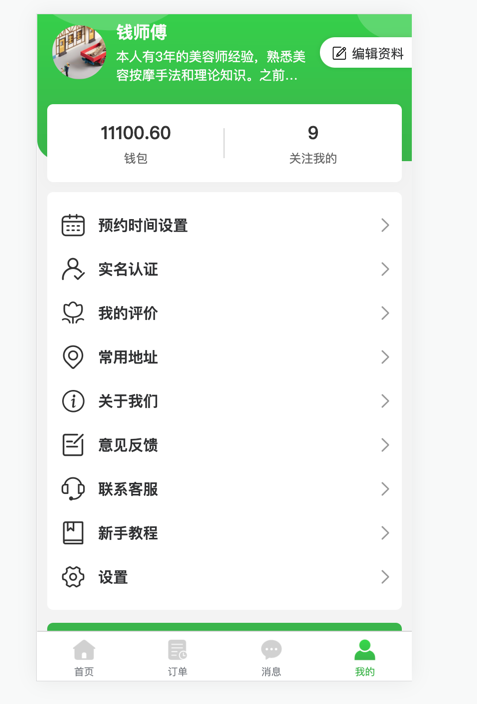

app

    1.首页
        a.轮播图
        b.推荐技师
        c.服务项目展示
        d.悬浮活动入口
        e.定位
        f.金刚区
        g.顶部签到/消息入口

    2.技师
        a.列表分页(详情和距离获取)
        b.条件查询(全部、推荐、单量、好评、距离)
        c.输入框查询(跳转搜索页面)
        d.技师详情(服务详情、评价列表、收藏/关注)
        e.定位

    3.订单
        a.列表分页
        b.条件查询(全部、已完成、待评价、售后(取消退款、投诉反馈))
        c.订单详情(删除、分析、售后)
        d.客服入口

    4.我的
        a.用户信息
        b.设置(语言切换/内存释放/退出登录/版本检测/免责声明)
        c.广告位
        d.优惠券入口
        e.钱包入口
        f.工具列表
    
    5.会员中心
        a.用户信息
        b.会员权益
        c.会员套餐
        e.支付

    6.钱包
        a.用户信息
        b.账单列表
        c.充值余额
    
    7.活动管理  
        a.签到活动
        b.抽奖活动
        c.积分活动
        e.优惠券活动
        f.推广活动

技师端
    
    1.首页
        a.轮播图
        b.更新定位
        c.收益情况(今天订单/今日车费/总订单金额/总车费金额/已用物料/剩余物料)
        d.服务订单
    
    2.订单
        a.订单列表
        b.条件筛选
        c.订单详情
    
    3.消息
        a.会话列表
    
    4.我的
        a.用户信息  
        b.钱包信息
        c.关注信息  
        d.认证管理
        e.余额时间设置
        f.
    
